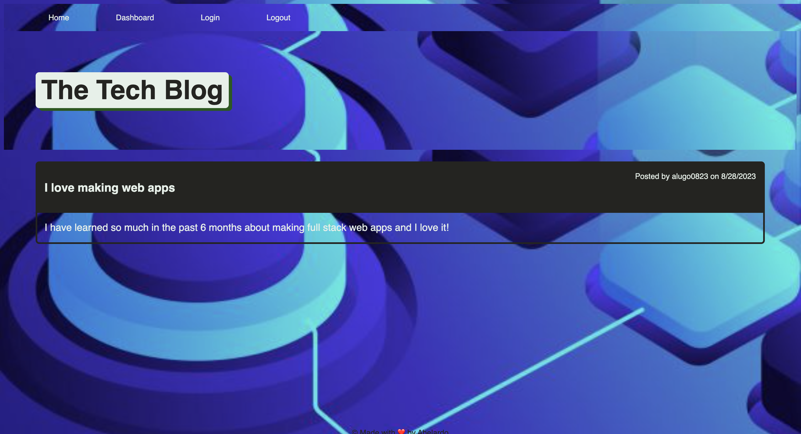

# tech-blog-app  
  ## Licensing: MIT 

  ## Description
    This application will use the entire MVC paradigm to create a full stack Tech Blog app that will be deployed through Heroku. The app will feature models, controllers, views, and also utilize css styling.
  ## Table of Contents
  
  -[Installation](#installation)
  -[Usage](#usage)
  -[Credits](#credits)
  -[License](#license)  
  -[Tech used](#tech-used)

  ## Installation
    There is no need to install anything for this app to function. This app will be deployed using Heroku.
    Deployed Heroku URL: https://tech-blog-mvc-ch14-36f729be7c47.herokuapp.com/
  ## Usage
    - The user may signup or login using the respective buttons on the webpage.
    - The user may create a new blog post by clicking on the + icon at the bottom.
    - The user may give their blog post a title and description

  
  ## Tech used
  * JavaScript
  * Node.JS
  * Express
  * CSS
  * Handlebars
  * MySQL2

  ## Credits
  Drew inspiration from https://git.bootcampcontent.com/University-of-Arizona/UofA-VIRT-FSF-PT-03-2023-U-LOLC/-/tree/main/17-CS

  ## Questions
  Have any questions or concerns? Here is where you can reach me:
  - Github: alugo0823
  - Email: lugo.kse23@gmail.com
  
  ## Screenshot
  